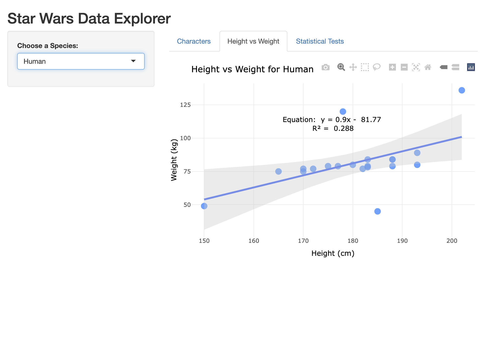

# starwars-data-explorer
Star Wars Data Explorer: R Shiny App to Explore Star Wars Characters


## Contents
1. [Overview](#1-overview)
2. [Repository](#2-repository)
3. [Features](#3-features)
4. [Deployment](#4-deployment)
5. [Technologies Used](#5-technologies-used)
6. [Dataset](#6-dataset)
7. [Height and Weight Categories](#7-height-and-weight-categories)
8. [License](#8-license)
9. [Author](#9-author)

## 1. Overview

Welcome to the **Star Wars Data Explorer**, an interactive Shiny app designed to allow users to explore and analyse various characteristics of Star Wars characters, including their species, sex, height and weight. The app provides several features such as visualising the relationship between height and weight, and conducting chi-squared tests to explore correlations among sex, height and weight.

This project aims to make Star Wars data more accessible and engaging through dynamic visualisations and statistical tests. By filtering the dataset based on species and analysing relationships, users can dive deeper into the characteristics of their favourite characters.

## 2. Repository
This repository contains the Shiny app code and associated files to run the Star Wars Data Explorer.
- [`starwars_explorer.R`](starwars_explorer.R) - An interactive Shiny app designed to allow users to explore and analyse various characteristics of Star Wars characters
- `starwars.csv` - CSV version of the **Star Wars** dataset
- [`README.md`](README.md) - README file


## 3. Features
- **Character Table**: Displays a filtered table of characters based on the selected species, showing details like height, weight, gender, and homeworld.
- **Height vs Weight**: Interactive scatter plot and static regression plot with a confidence interval to explore the relationship between height and weight.
- **Gender vs Homeworld**: A chi-squared statistical test to examine the relationship between character gender and their homeworld. The results are displayed along with an explanation of the test's significance.

- **Characters Table**: Displays a filtered table of characters based on the selected species, showing details like Name, Species, Sex, Height, Height and Weight.
- **Height vs Weight**: Interactive scatter plot with tooltip information and a linear regression line to explore the relationship between height and weight. The equation and R-squared value are displayed when there are enough data points.
- **Statistical Tests**: Chi-squared statistical tests to examine the relationship between sex and height/weight categories, and between height and weight categories.


## 4. Deployment

### Installation

To run this app locally, follow the steps below:

1. **Install R**: Download and install R from the [official R website](https://cran.r-project.org/).

2. **Install RStudio** (optional but recommended): Download and install RStudio from [RStudio's website](https://www.rstudio.com/).

3. **Install Required Packages**: The following R packages are required to run the Shiny app:
- `shiny`
- `tidyverse`
- `plotly`

   You can install these packages by running the following commands in the R console:

   ```r
   install.packages("shiny")
   install.packages("tidyverse")
   install.packages("plotly")
   ```

4. **Run the Application**: To run the app locally, simply clone or download the repository to your machine. Then, open R (or RStudio), navigate to the folder where you saved the app, and run the following command:


   ```r
   shiny::runApp("path/to/starwars_explorer.R")
   ```

Replace `path/to/starwars-explorer.R` with the actual file path, and the app will launch in your default web browser for you to start exploring!


## 5. Technologies Used
This project is built using the following technologies:
- **`Shiny`**: An R package for building interactive web applications.
- **`dplyr`** and **`tidyr`**: R packages for data manipulation and cleaning.
- **`ggplot2`**: A data visualisation package for creating static plots.
- **`plotly`**: A library for creating interactive plots, used in the scatter plot.
- **`R`**: The programming language used for data analysis and app development.

Note: `dplyr`, `tidyr` and `ggplot2` are core parts of `tidyverse`, a collection of R packages designed for data science.


## 6. Dataset
The **Star Wars** dataset is included with the **`dplyr`** package. This dataset contains information about various Star Wars characters, including their species, gender, height, weight, homeworld, and more. To use this dataset, you must install the `tidyverse` package.


## 7. Height and Weight Categories
The app categorises characters based on their height and weight into distinct categories for easier analysis. The categories are defined as follows:

**Height Categories**
| Category | Height Range (cm) |
| --- | --- |
| Short | Less than 150 cm |
| Medium | 150 cm to 170 cm |
| Tall | 170 cm to 190 cm |
| Very Tall | More than 190 cm |

**Weight Categories**
| Category | Weight Range (kg) |
| --- | --- |
| Underweight | Less than 50 kg |
| Normal | 50 kg to 75 kg |
| Overweight | 75 kg to 100 kg |
| Obese | 100 kg to 150 kg |
| Very Obese | More than 150 kg |

These categories are used to help users explore the relationships between gender, height, and weight within the dataset.





## 8. License
This project is licensed under the MIT License. See the [LICENSE](LICENSE) file for more information.


## 9. Author
This project is developed and maintained by [Bernard Tse](https://github.com/bernardtse), with assistance from [OpenAI](https://openai.com)’s ChatGPT in areas such as code refinement, optimisation, and debugging.